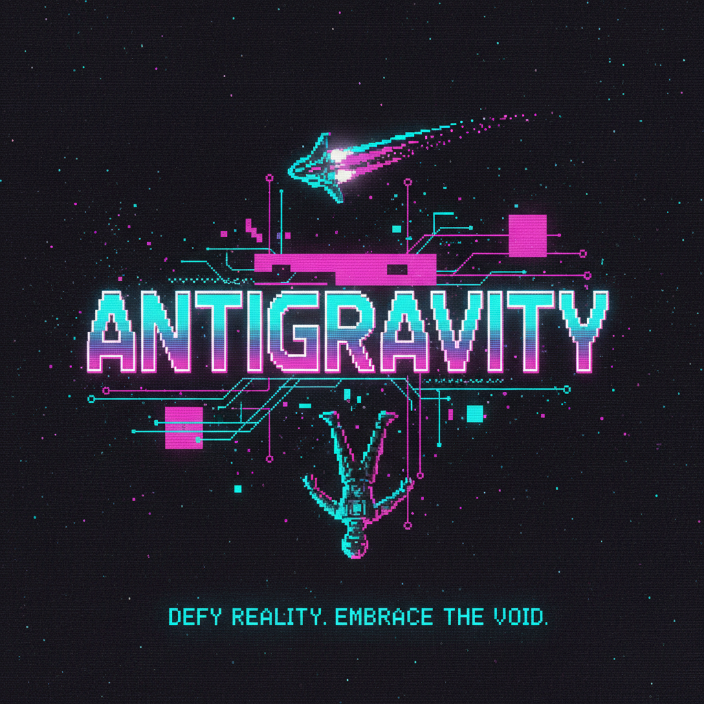

# ANTIGRAVITY

**ANTIGRAVITY** is a high-octane, top-down RPG where you defy physics and fight through neon-soaked levels. Master the **Gravity Dash** to obliterate enemies and traverse dangerous terrain.

## 🎮 Controls

| Action | Key |
| :--- | :--- |
| **Move** | `WASD` or `Arrow Keys` |
| **Dash / Attack** | `SPACE` |
| **Select / Start** | `ENTER` |

## 🎯 Objective

1.  **Explore**: Navigate through procedurally generated levels.
2.  **Survive**: Dodge enemy attacks and use your **Gravity Dash** to destroy them.
    *   **Normal Enemies (Red)**: Basic chasers.
    *   **Fast Enemies (Orange)**: Quick and deadly.
    *   **Tank Enemies (Purple)**: tough to kill.
3.  **Level Up**: Collect **XP Orbs (Green)** to increase your stats.
4.  **Power Up**: Grab **Lightning Bolts** for speed and **Shields** for invulnerability.
5.  **The Goal**: Find the **Yellow Goal Zone** to advance to the next level.
6.  **The Boss**: On Level 3, you must defeat the **Boss**.
    *   **Tip**: The Boss shoots yellow projectiles. **Dash through them** or dodge!
    *   **Tip**: Dash *into* the Boss to damage it.

## 🚀 How to Run

1.  Open `index.html` in your browser.
2.  Enjoy!

## 🛠️ Tech Stack

*   **Engine**: Custom Vanilla JS Game Engine
*   **Rendering**: HTML5 Canvas API
*   **Audio**: Web Audio API (Synthesized Sound Effects)
